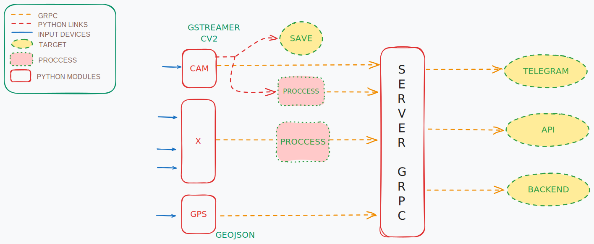

# GRPC Python Project
Grpc project for transfering frames, from clients to server, from a video source, geojson data and some generic data.

## Initial idea:´

## How to Run

To start the server: `python server_grpc7.py`

Depending on what you want to transmit, start the corresponding client (or multiple ones):
- `cam_client.py`: Module for capturing images from a camera and transmitting them to the gRPC server.
- `cliente_imagen.py`: Module for sending images to the gRPC server.
- `cliente_simple.py`: Module for sending generic messages to the gRPC server (usually text).
- `gps_client3.py`: Module that retrieves data from a GPS (managed with a virtual serial port) and sends it to the gRPC server.

### Description of Files

- **protobuf**: Folder containing the .proto files for message type structures.
- `cam_client.py`: Module for capturing images from a camera and transmitting them to the gRPC server.
- `cliente_imagen.py`: Module for sending images to the gRPC server.
- `cliente_simple.py`: Module for sending generic messages to the gRPC server (usually text).
- `frame_pb2.py`, `frame_pb2_grpc.py`, `generic_pb2_grpc.py`, `gps_1403_pb2.py`, `gps_1403_pb2_grpc.py`: Automatically generated modules when compiling the .proto files.
- `gps_client3.py`: Module that retrieves data from a GPS (managed with a virtual serial port) and sends it to the gRPC server.
- `server_grpc7.py`: This script implements a gRPC server that can receive various types of data, including images, GPS data, and generic payloads. It saves received data to files and optionally sends images to a Telegram bot. It includes gRPC service implementations for handling different data types, such as DataService for generic data, DataGPSService for GPS data, and FrameSenderServicer for image frames. The script also contains utility functions for sending text and image messages to a Telegram bot.
